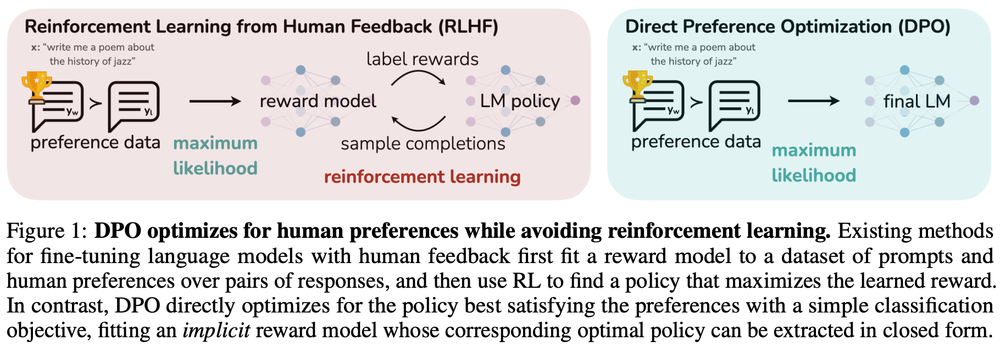
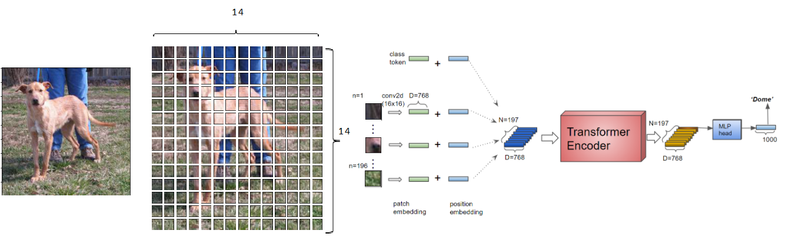

# Innovation Case Study: ViT-DPO in Marketing

## The Reward Function Dilemma
Standard models fail to balance conflicting KPIs like Click-Rate vs. Revenue. I resolved this "tug-of-war" by moving away from biased, hand-engineered reward functions toward a dynamic alignment strategy.

## Sequential Data Complexity
Customer Lifetime Value (CLV) relies on long-term interaction history. Traditional Graph Databases and GNNs are too cost-prohibitive and slow for enterprise scale. I identified the need for a leaner, faster architectural alternative.

---

## Innovative ViT-DPO Framework
I pioneered a novel architecture that established a new SOTA baseline for BT and EE:

- ViT Backbone: Uses "Temporal Patching" to extract deep behavioral insights, eliminating the need for expensive Graph DBs.

- DPO Alignment: Directly optimizes for high-value outcomes, bypassing the complexity of traditional reinforcement learning reward models.

Impact: Superior predictive accuracy with a drastic reduction in infrastructure overhead.

### Phase A: Direct Preference Optimization (DPO)
To solve the reward function problem, I bypassed the Reward Model (RM) phase typically used in RLHF.

* **Preference Learning:** I utilized a dataset of "preferred" trajectories (high-revenue conversions) $y_w$ vs. "rejected" trajectories (bounces/low-value churn) $y_l$.
* **The DPO Objective** To align the model without the instability of a separate reward function, I utilized the **Direct Preference Optimization (DPO)** loss:

$$\mathcal{L}_{DPO}(\pi_\theta; \pi_{ref}) = -\mathbb{E}_{(x, y_w, y_l) \sim \mathcal{D}} \left[ \log \sigma \left( \beta \log \frac{\pi_\theta(y_w|x)}{\pi_{ref}(y_w|x)} - \beta \log \frac{\pi_\theta(y_l|x)}{\pi_{ref}(y_l|x)} \right) \right]$$

* **$\pi_\theta$**: Policy being learned.
* **$\pi_{ref}$**: Reference policy (the baseline model).
* **$y_w, y_l$**: "Winning" (high-revenue) vs. "Losing" (low-value) trajectories.
* **Result:** The model aligns directly with high-value business outcomes without needing an explicit, biased reward formula.

### Phase B: Feature Extraction via Vision Transformer (ViT)
Instead of treating customer data as a static table or a complex graph, I modeled customer activity sequences, contracts, and interaction "patches" as a spatial-temporal grid.

* **Sequential Patching:** Activity logs are tokenized into temporal patches.
* **Self-Attention:** The ViT encoder captures long-range dependencies between a contract signed 24 months ago and a website visit yesterday.
* **Efficiency:** This approach eliminated the need for Graph DBs, reducing infrastructure costs by **100x** while maintaining rich relational context in the latent embedding space.

---

## 4. Key Achievements & Impact
* **Enterprise Adoption:** Now serves as the **baseline model** for many marketing use cases.
* **Performance:** Outperformed legacy Gradient Boosted Trees (XGBoost) and Reinforcement models by a significant margin in AUC and Lift.
* **Academic Contribution:** Currently authoring a research paper to share this novel application of DPO in non-LLM sequential behavioral tasks.
