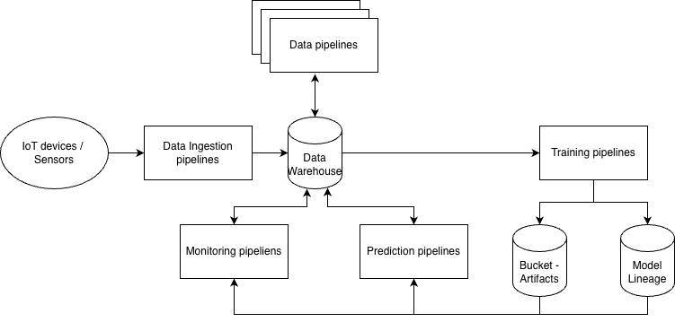

# Smiths Group Overview

## 1. John Crane (Energy & Industrial Services)
*   **Introduction**: John Crane provides critical engineering solutions for fluid handling, focusing on mechanical seals and power transmission for the energy sector.
*   **Revenue**: £1,016m
*   **Cost**: £756m (Estimated)
*   **Operating Margin**: 25.6%

## 2. Smiths Detection (Security & Defence)
*   **Introduction**: This division specializes in threat detection technologies used globally in airports, ports, and critical infrastructure.
*   **Revenue**: £701m
*   **Cost**: £590m (Estimated)
*   **Operating Margin**: 15.8%

## 3. Flex-Tek (Aerospace & Industrial)
*   **Introduction**: Flex-Tek manufactures engineered components that heat and move fluids and gases for aerospace and construction markets.
*   **Revenue**: £681m
*   **Cost**: £544m (Estimated)
*   **Operating Margin**: 20.1%

## 4. Smiths Interconnect (Electronics & Connectivity)
*   **Introduction**: This section delivers technically differentiated electronic components and sub-systems for high-speed connectivity and satellite communications.
*   **Revenue**: £428m
*   **Cost**: £371m (Estimated)
*   **Operating Margin**: 13.3%

# Machine Learning Foundation

A high-performance Machine Learning foundation is the prerequisite for scalable AI. A robust MLOps framework must seamlessly integrate data ingestion, preparation, model training, prediction, and continuous monitoring to ensure system reliability and performance.

| Component | **GCP** | **Azure** | **AWS** |
| :--- | :--- | :--- | :--- |
| **Orchestration** | Cloud Workflows | Azure Data Factory | AWS Step Functions |
| **Stream Processing** | Dataflow / Kafka | Event Hubs / Databricks | Kinesis / MSK |
| **Data Processing** | BigQuery / Dataproc | Azure Synapse / Databricks | EMR / Glue |
| **Data Warehouse** | BigQuery / BigLake | Azure Synapse | Amazon Redshift / Athena |
| **Other Data Storage** | Cloud Storage | Azure Blob Storage | Amazon S3 |
| **Training Pipeline** | Vertex AI | Azure Machine Learning (Azure ML) | SageMaker |
| **Model Lineage** | Vertex ML Metadata / BigQuery | Azure ML Registry & Lineage / Synapse | SageMaker ML Lineage / Athena |
| **Model Artifact** | Cloud Storage (Bucket) | Azure Blob Storage | Amazon S3 |
| **Prediction Pipelines**| Vertex / Cloud Run | Azure ML Endpoints / AKS | SageMaker / Lambda / Fargate |
| **Monitoring** | BigQuery / Dataplex | Azure Monitor / Sentinel | CloudWatch / SageMaker Monitor |
| **Trigger** | Cloud Scheduler / Pub/Sub | Event Grid / Azure Scheduler | EventBridge / SNS |

## Data Ingestion

Data originates from a vast array of heterogeneous sources: Industrial IoT (IIoT) devices, high-frequency sensors, third-party APIs, client telemetry, and internal operational databases.  The primary objective of the ingestion layer is to stream, normalize, and shape raw data into a standardized schema before persisting it into a centralized Data Warehouse or Data Lake for downstream analytics and training.

## Data Warehouse

The Data Warehouse serves as the central nervous system of the ML platform, acting as the authoritative repository for all training, prediction, and telemetry data. Beyond simple storage, it persists real-time inference results and monitoring metadata to facilitate continuous model validation and iterative retraining cycles. This centralized architecture ensures that historical performance data is readily available for rigorous audit trails, drift analysis, and post-deployment model reviews, ultimately closing the feedback loop between production and research.

## Data Pipelines

In large-scale enterprises, data processing represents a significant operational cost, as it involves preparing and transforming data across disparate departments. To mitigate redundant efforts and eliminate data silos, we implement a centralized architecture featuring **Event Marts**, **Feature Marts**, and **Prediction Marts**. These specialized repositories utilize structured schemas that allow users to extract and manage high-quality data with minimal friction. To ensure cost-efficiency and performance at scale, we prioritize advanced optimization techniques such as logical partitioning, data clustering, and non-joining aggregation strategies (MAX-GROUP) to minimize compute overhead and query latency.

## Training Pipeline

The training pipeline is an automated, reproducible workflow designed to transform raw features into production-ready models. It orchestrates the entire machine learning lifecycle—including data validation, hyperparameter tuning, and distributed training—ensuring that every model is built on a consistent, version-controlled foundation. By decoupling the compute environment from the code, the pipeline allows for seamless scaling across GPU/CPU clusters, facilitating rapid experimentation while maintaining the rigorous standards required for mission-critical industrial applications.

## Model Artifacts (Storage Buckets)

Model artifacts represent the tangible output of the training pipeline, encompassing serialized model objects, weights, configuration files, and preprocessing schemas. These assets are persisted in highly durable, versioned storage buckets to serve as a "Single Source of Truth" for deployment. This storage strategy ensures that any specific version of a model can be retrieved and redeployed instantly, providing the necessary infrastructure for rollbacks and A/B testing in live production environments.

## Model Lineage

Model lineage provides a comprehensive audit trail that maps the journey of a model from its raw data origins to its current production state. It tracks critical metadata, including the specific dataset version, code commit, hyperparameters, and environment variables utilized during the training lifecycle. This traceability is fundamental for governance and compliance, enabling engineers to reproduce specific results, debug performance degradation, and verify that AI-driven decisions are derived from authorized and accurate data streams.

In complex enterprise environments where the ML platform supports multiple heterogeneous serving layers (e.g., hybrid cloud or cross-provider edge deployment), relying solely on cloud-native lineage tools may not be recommended. In these scenarios, implementing a decoupled or platform-agnostic metadata store ensures consistent visibility and auditability across all deployment targets, preventing data silos and vendor lock-in.

## Prediction Pipeline

The prediction pipeline encompasses both high-throughput batch processing and low-latency real-time endpoints. By integrating directly with the standardized model lineage and artifact repository, the serving layer can dynamically retrieve specific model versions or automatically promote the latest "champion" model for inference. This standardized decoupling of artifacts ensures that models can be deployed seamlessly across heterogeneous environments—whether on-premise, cloud-native, or at the edge—without code refactoring. 

To maintain performance when processing large-scale datasets (GB/TB-level), the pipeline must utilize advanced batch data strategies and low-level Python optimizations. This includes the implementation of parallel processing, efficient memory management, and vectorized operations to minimize compute latency and operational overhead. Detailed strategies for these enhancements are documented in the **Optimization** section.

## Monitoring Pipeline

Monitoring is a critical pillar of the MLOps lifecycle, as standard infrastructure monitoring (such as basic exit code tracking) is insufficient for detecting silent failures in machine learning workflows. While data and prediction pipelines may technically execute without error, they can yield empty outputs or "null" results that go unnoticed by traditional health checks.

Furthermore, machine learning models are inherently sensitive to shifts in feature distributions. To maintain model integrity, we must implement continuous tracking of Data Drift, Target Drift, and Prediction Drift. This ensures that any divergence between the training environment and real-world data is immediately identified. Upon detecting significant statistical shifts, the system automatically alerts data scientists, triggering necessary investigations or model retraining to prevent performance degradation.