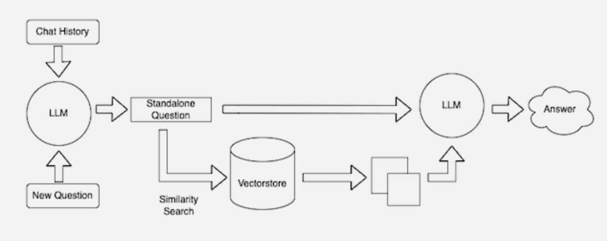

# Deep learning

## Computer vision
1. Algorithm
   - Image classification
     - VGG
     - ResNet
     - EfficientNet (Strong)
     - MobileNet (Fast)
   - Object Detection
     - Yolov5 (Fast)
     - Faster RCNN
     - EfficientNet-D7 (Strong)
   - Image Segmentation
     - Mask RCNN
     - U-Net
   - Video Classification
     - MoViNet (Fast&Strong)
   - Others
     - Human Pose
     - Style Transfer
     - GAN Model
     - Increase Resolution
2. Data Augmentation
   - Flipping
   - Rotation
   - Scaling

## NLP
1. Algorithm
   - Text embedding (Classification)
     - Word
       - Word2vec
       - Glove
     - Chatbot
       - GPT3
         - Pretraining
         - Supervised Finetuning
         - Reward Modeling
         - Reinforcement Learning
       - Deepseek
         - Mixture of Experts (Less Precision)
     - Others
       - Summarisation
       - Translation
       - Question answering
       - Entity recognition
2. Data Augmentation
   - Synonym replacement
   - Insert, swap, deletion

## Generative AI
1. Text Generation
   - GPT
   - Gemini
   - Claude
   - Grok
2. Image Generation
   - DALL-E 
   - Midjourney
   - Stable Diffusion
3. Code Generation
   - Github Copilot
   - Amazon Q Developer
4. Audio Generation
   - Murf.ai
   - Amper Music
5. Video Generation
   - Runway ML

## GraphNet
1. Embedding
   - Matrix factorization based methods
   - Random walk based methods
     - Node2Vec
   - Graph Neural Network
     - Graph Convolutional Networks
   - AutoEncoder
2. Idea
   - Node
   - Edge
   - Property

# Evaluation
1. Off policy evaluation

### RAG Retrieval-Augmented Generation

Questions > LLM > Prompt > Get information from vector database > LLM > Output

## Data base
1. SQL (Table)
2. NoSQL (Doc)
3. Graph (Node/Edge/Property)
4. Vector (Embedding)
   - Usecases
     - Word
     - Video
     - Image
     - Recommendation
   - Benefits
     - Flexibility
     - Scability
     - Easy to compare
     - Grow the database
     - Increase speed and performance
     - Search by embedding
5. Storage